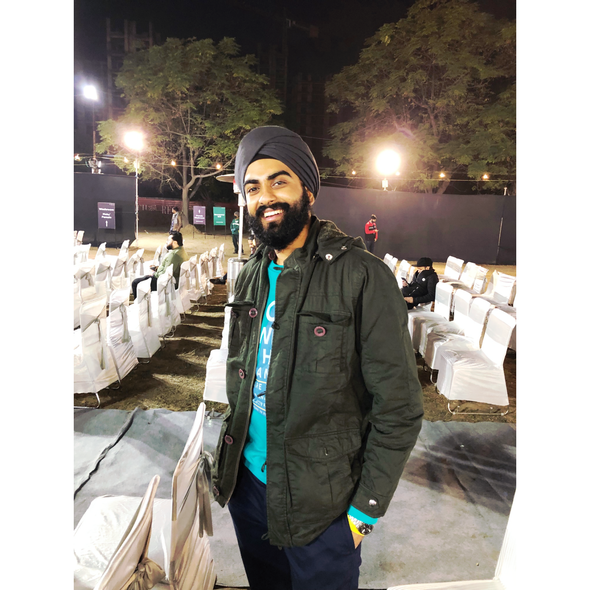

“*My life revolves around technology like the planets revolve around the sun.*“☀️

I am graduate student at **Concordia University, Montréal** pursuing **Master's in Applied Computer Science.** Throughout my career, I have demonstrated an ability to collaborate and execute with colleagues of different seniority ranging from batch-mates to upper-management in order to push my boundaries and learn about new things everyday.

Prior to my master's, I have obtained over 1.5 years of experience in designing machine learning and data science solutions using python. I have worked as a **Data Engineer** at India’s top research institute, [Indian Institute of Science](https://www.serc.iisc.ac.in/supercomputer/for-traditional-hpc-simulations-param-pravega/) followed by **Jr. Data Scientist** at [Tatras Data.](https://tatrasdata.com/) Additionally, I have also worked as a **Data Science Intern** at the [Sabudh Foundation](https://sabudh.org/) which initiated my journey in data science *to make machines predict the future by connecting the dots from the past.*  

Before moving to the realm of machine learning, I have had the opportunity to work in backend development and as a Google Summer of Code (GSOC) mentor in organization like **PublicLab and DIAL.** Currently, **I am seeking Internship/ Co-op opportunities for Summer 2023** in field of data science, data engineering, machine learning and artificial intelligence.

<!-- I'm a research scientist at the University of Illinois Urbana-Champaign's [Institute for Sustainability, Energy, and Environment](https://sustainability.illinois.edu/).

My recent [research]({{site.baseurl}}/research.html) is primarily in soil carbon, water quality, and childhood lead poisoning. My methodological interests include Bayesian multilevel and spatiotemporal modeling, causal inference, targeted interventions, and experimental design.

I was previously at the University of Chicago's [Harris School of Public Policy](http://harris.uchicago.edu) and [Center for Data Science and Public Policy](http://dsapp.uchicago.edu). Before that, I studied mathematics at Northwestern where my [dissertation]({{site.baseurl}}/assets/pdf/dissertation.pdf) was in the field of geometric analysis. -->
