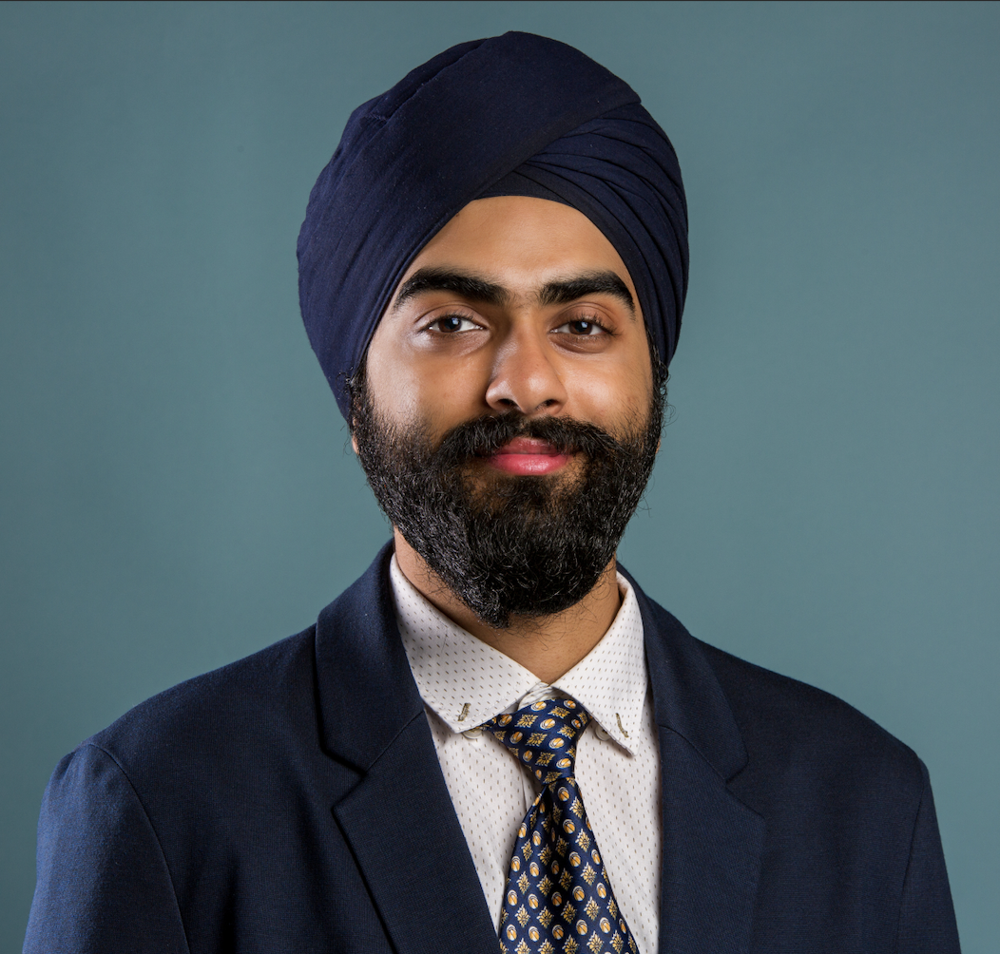

<!-- SUMMARY --> 

I am **master's graduate in Applied Computer Science from Concordia University, Montréal**. Throughout my career, I have obtained a thorough experience in designing machine learning & data science solutions and have demonstrated an ability to collaborate and contribute with colleagues of different seniority levels.

<!-- ranging from my classmates to upper-management in order to push my boundaries.  -->

Previously, I have worked as a **Data Scientist** at [Intact Financial Corporation](https://intactlab.ca/), Canada's leading insurance company. During my tenure, I communicated insights to identify customer segments using NER with higher risk profiles, significantly `boosting marketting, cross-selling and upselling efforts.` My work involved applying `Random Forests and other machine learning algorithms` to analyze historical claims data for forecasting potential claim scenarios, conducting fraud analysis and churn analysis. I also utilized  `NLP for transcript & claims data ` target solutions for `risky claims and behaviors` to increase in customer retention.

<!-- I played a pivotal role in the development of `CallQualitySearch`—evaluating the quality of calls. My responsibilities included assessing precision and recall values for rule triggers, where I skillfully visualized these metrics to enhance performance insights. I also proficiently utilized `SQL to extract complex data`, enabling a comprehensive understanding of the `relation between the ROC model for inbound and outbound calls.`
This experience not only honed my data science skills but also showcased my ability to derive meaningful conclusions from complex datasets. I am eager to apply my knowledge to solve real-world problems and to make machines predict the future by connecting the dots from the past. -->

Before my master's, I was working as a **Jr. Data Scientist** for [Tatras Data](https://tatrasdata.com/){:target="_blank"}, as a **Jr. Data Engineer** at the [Indian Institute of Science](https://www.serc.iisc.ac.in/supercomputer/for-traditional-hpc-simulations-param-pravega/){:target="_blank"} and lastly, as a **Data Science Intern** with [Sabudh Foundation](https://sabudh.org/){:target="_blank"} which initiated my journey in data science. Before moving to the realm of data science, I have also contributed in backend development and have participated in `Google Summer of Code (GSOC)` as a mentor for organizations like `PublicLab and DIAL` as well.

Currently, I am seeking **full-time opportunities** in field of data analysis/engineering/science and machine learning.

<!-- ----------------EXPERIENCE----------------------  -->

<h3 style="text-align: left;">Experience</h3>

&#8226; [**Intact Financial Corporation (Montreal)**](https://intactlab.ca/){:target="_blank"} &nbsp;&nbsp;&nbsp;&nbsp;&nbsp;&nbsp;&nbsp;&nbsp;&nbsp;&nbsp;&nbsp;&nbsp;&nbsp;&nbsp;&nbsp;&nbsp;&nbsp;&nbsp;&nbsp;&nbsp;&nbsp;&nbsp;&nbsp;&nbsp;&nbsp;&nbsp;&nbsp;&nbsp;&nbsp;&nbsp;&nbsp;&nbsp;&nbsp;&nbsp;&nbsp;&nbsp;&nbsp;&nbsp;&nbsp;&nbsp;&nbsp;&nbsp;&nbsp;&nbsp;&nbsp;&nbsp;&nbsp;&nbsp;&nbsp;&nbsp;&nbsp;&nbsp;&nbsp;&nbsp;&nbsp;&nbsp;&nbsp;&nbsp;&nbsp;&nbsp;&nbsp;&nbsp;&nbsp;&nbsp;&nbsp;&nbsp;&nbsp;&nbsp;&nbsp;&nbsp;&nbsp;&nbsp;&nbsp;&nbsp;&nbsp;&nbsp;&nbsp;&nbsp;&nbsp;&nbsp;&nbsp;&nbsp;&nbsp;&nbsp;&nbsp;&nbsp;&nbsp;&nbsp;&nbsp;&nbsp;&nbsp;&nbsp;&nbsp;&nbsp;&nbsp;&nbsp;&nbsp;&nbsp;&nbsp;&nbsp;&nbsp;&nbsp;&nbsp;&nbsp;&nbsp;&nbsp;&nbsp;&nbsp;&nbsp;&nbsp;&nbsp;&nbsp;&nbsp;&nbsp;&nbsp;&nbsp;&nbsp;&nbsp;&nbsp;&nbsp;&nbsp;&nbsp;&nbsp;&nbsp;&nbsp;&nbsp;&nbsp;&nbsp;&nbsp;&nbsp;&nbsp;&nbsp;&nbsp;&nbsp;&nbsp;&nbsp;&nbsp;&nbsp;&nbsp;&nbsp;&nbsp;&nbsp;&nbsp;&nbsp;&nbsp; **Sept 2023 - Dec 2023** 
&nbsp;&nbsp; `Data Scientist` 

&#8226; [**Tatras Data Services**](https://tatrasdata.com/){:target="_blank"} &nbsp;&nbsp;&nbsp;&nbsp;&nbsp;&nbsp;&nbsp;&nbsp;&nbsp;&nbsp;&nbsp;&nbsp;&nbsp;&nbsp;&nbsp;&nbsp;&nbsp;&nbsp;&nbsp;&nbsp;&nbsp;&nbsp;&nbsp;&nbsp;&nbsp;&nbsp;&nbsp;&nbsp;&nbsp;&nbsp;&nbsp;&nbsp;&nbsp;&nbsp;&nbsp;&nbsp;&nbsp;&nbsp;&nbsp;&nbsp;&nbsp;&nbsp;&nbsp;&nbsp;&nbsp;&nbsp;&nbsp;&nbsp;&nbsp;&nbsp;&nbsp;&nbsp;&nbsp;&nbsp;&nbsp;&nbsp;&nbsp;&nbsp;&nbsp;&nbsp;&nbsp;&nbsp;&nbsp;&nbsp;&nbsp;&nbsp;&nbsp;&nbsp;&nbsp;&nbsp;&nbsp;&nbsp;&nbsp;&nbsp;&nbsp;&nbsp;&nbsp;&nbsp;&nbsp;&nbsp;&nbsp;&nbsp;&nbsp;&nbsp;&nbsp;&nbsp;&nbsp;&nbsp;&nbsp;&nbsp;&nbsp;&nbsp;&nbsp;&nbsp;&nbsp;&nbsp;&nbsp;&nbsp;&nbsp;&nbsp;&nbsp;&nbsp;&nbsp;&nbsp;&nbsp;&nbsp;&nbsp;&nbsp;&nbsp;&nbsp;&nbsp;&nbsp;&nbsp;&nbsp;&nbsp;&nbsp;&nbsp;&nbsp;&nbsp;&nbsp;&nbsp;&nbsp;&nbsp;&nbsp;&nbsp;&nbsp;&nbsp;&nbsp;&nbsp;&nbsp;&nbsp;&nbsp;&nbsp;&nbsp;&nbsp;&nbsp;&nbsp;&nbsp;&nbsp;&nbsp;&nbsp;&nbsp;&nbsp;&nbsp;&nbsp;&nbsp;&nbsp;&nbsp;&nbsp;&nbsp;&nbsp;&nbsp;&nbsp;&nbsp;&nbsp;&nbsp;&nbsp;&nbsp;&nbsp;&nbsp;&nbsp;&nbsp;&nbsp;&nbsp;&nbsp;&nbsp;&nbsp;&nbsp;&nbsp;&nbsp;&nbsp;&nbsp;&nbsp;&nbsp;&nbsp;&nbsp;&nbsp;&nbsp; **Dec 2021 - Aug 2022** 
&nbsp;&nbsp; `Junior Data Scientist` 

&#8226; [**Indian Institute of Science (IISc)**](https://www.serc.iisc.ac.in/supercomputer/for-traditional-hpc-simulations-param-pravega/){:target="_blank"} &nbsp;&nbsp;&nbsp;&nbsp;&nbsp;&nbsp;&nbsp;&nbsp;&nbsp;&nbsp;&nbsp;&nbsp;&nbsp;&nbsp;&nbsp;&nbsp;&nbsp;&nbsp;&nbsp;&nbsp;&nbsp;&nbsp;&nbsp;&nbsp;&nbsp;&nbsp;&nbsp;&nbsp;&nbsp;&nbsp;&nbsp;&nbsp;&nbsp;&nbsp;&nbsp;&nbsp;&nbsp;&nbsp;&nbsp;&nbsp;&nbsp;&nbsp;&nbsp;&nbsp;&nbsp;&nbsp;&nbsp;&nbsp;&nbsp;&nbsp;&nbsp;&nbsp;&nbsp;&nbsp;&nbsp;&nbsp;&nbsp;&nbsp;&nbsp;&nbsp;&nbsp;&nbsp;&nbsp;&nbsp;&nbsp;&nbsp;&nbsp;&nbsp;&nbsp;&nbsp;&nbsp;&nbsp;&nbsp;&nbsp;&nbsp;&nbsp;&nbsp;&nbsp;&nbsp;&nbsp;&nbsp;&nbsp;&nbsp;&nbsp;&nbsp;&nbsp;&nbsp;&nbsp;&nbsp;&nbsp;&nbsp;&nbsp;&nbsp;&nbsp;&nbsp;&nbsp;&nbsp;&nbsp;&nbsp;&nbsp;&nbsp;&nbsp;&nbsp;&nbsp;&nbsp;&nbsp;&nbsp;&nbsp;&nbsp;&nbsp;&nbsp;&nbsp;&nbsp;&nbsp;&nbsp;&nbsp;&nbsp;&nbsp;&nbsp;&nbsp;&nbsp;&nbsp;&nbsp;&nbsp;&nbsp;&nbsp;&nbsp;&nbsp;&nbsp;&nbsp;&nbsp;&nbsp;&nbsp;&nbsp;&nbsp;&nbsp;&nbsp;&nbsp;&nbsp;&nbsp;&nbsp;&nbsp;&nbsp;&nbsp;&nbsp;&nbsp;&nbsp;&nbsp;&nbsp;&nbsp;&nbsp;&nbsp;&nbsp;&nbsp;&nbsp;&nbsp;&nbsp;&nbsp;&nbsp;&nbsp; **Aug 2021 - Jan 2022** 
&nbsp;&nbsp; `Junior Data Engineer  - Supercomputer Education and Research Centre` 

&#8226; [**Sabudh Foundation**](https://sabudh.org/){:target="_blank"} &nbsp;&nbsp;&nbsp;&nbsp;&nbsp;&nbsp;&nbsp;&nbsp;&nbsp;&nbsp;&nbsp;&nbsp;&nbsp;&nbsp;&nbsp;&nbsp;&nbsp;&nbsp;&nbsp;&nbsp;&nbsp;&nbsp;&nbsp;&nbsp;&nbsp;&nbsp;&nbsp;&nbsp;&nbsp;&nbsp;&nbsp;&nbsp;&nbsp;&nbsp;&nbsp;&nbsp;&nbsp;&nbsp;&nbsp;&nbsp;&nbsp;&nbsp;&nbsp;&nbsp;&nbsp;&nbsp;&nbsp;&nbsp;&nbsp;&nbsp;&nbsp;&nbsp;&nbsp;&nbsp;&nbsp;&nbsp;&nbsp;&nbsp;&nbsp;&nbsp;&nbsp;&nbsp;&nbsp;&nbsp;&nbsp;&nbsp;&nbsp;&nbsp;&nbsp;&nbsp;&nbsp;&nbsp;&nbsp;&nbsp;&nbsp;&nbsp;&nbsp;&nbsp;&nbsp;&nbsp;&nbsp;&nbsp;&nbsp;&nbsp;&nbsp;&nbsp;&nbsp;&nbsp;&nbsp;&nbsp;&nbsp;&nbsp;&nbsp;&nbsp;&nbsp;&nbsp;&nbsp;&nbsp;&nbsp;&nbsp;&nbsp;&nbsp;&nbsp;&nbsp;&nbsp;&nbsp;&nbsp;&nbsp;&nbsp;&nbsp;&nbsp;&nbsp;&nbsp;&nbsp;&nbsp;&nbsp;&nbsp;&nbsp;&nbsp;&nbsp;&nbsp;&nbsp;&nbsp;&nbsp;&nbsp;&nbsp;&nbsp;&nbsp;&nbsp;&nbsp;&nbsp;&nbsp;&nbsp;&nbsp;&nbsp;&nbsp;&nbsp;&nbsp;&nbsp;&nbsp;&nbsp;&nbsp;&nbsp;&nbsp;&nbsp;&nbsp;&nbsp;&nbsp;&nbsp;&nbsp;&nbsp;&nbsp;&nbsp;&nbsp;&nbsp;&nbsp;&nbsp;&nbsp;&nbsp;&nbsp;&nbsp;&nbsp;&nbsp;&nbsp;&nbsp;&nbsp;&nbsp;&nbsp;&nbsp;&nbsp;&nbsp;&nbsp;&nbsp;&nbsp;&nbsp;&nbsp;&nbsp;&nbsp;&nbsp;&nbsp;&nbsp;&nbsp; **Jan 2021 - July 2021** 
&nbsp;&nbsp; `Data Science Intern`

<!-- ------------- PROJECTS ------------------ -->

<!-- ### Projects [**[Link]**]({{site.baseurl}}/projects){:target="_blank"}

&nbsp;&nbsp;1. **Processing Image Advertisements for Contextual Analysis**  
&nbsp;&nbsp;2. **Steamgestion - A Data Ingestion Pipeline**  
&nbsp;&nbsp;3. **Credit Risk Modelling**  
&nbsp;&nbsp;4. **Lung Disease Classification using Chest X-rays**  
&nbsp;&nbsp;5. **News Recommendation System**   -->

<!-- -------------- SKILLS --------------------- -->

<!-- My Skills:
✅𝐏𝐫𝐨𝐠𝐫𝐚𝐦𝐦𝐢𝐧𝐠:⠀⠀⠀ ⠀⠀⠀⠀Python, Java
✅𝐌𝐚𝐜𝐡𝐢𝐧𝐞 𝐋𝐞𝐚𝐫𝐧𝐢𝐧𝐠:⠀⠀⠀ ⠀Numpy, Pandas, Scikit-Learn, Pytorch, Keras
✅𝐃𝐚𝐭𝐚 𝐕𝐢𝐬𝐮𝐚𝐥𝐢𝐳𝐚𝐭𝐢𝐨𝐧:⠀⠀⠀ ⠀Matplotlib, Seaborn, Power BI
✅𝐃𝐚𝐭𝐚𝐛𝐚𝐬𝐞𝐬:⠀⠀⠀ ⠀⠀⠀⠀ ⠀⠀SQL, MySQL, PostgresQL
✅𝐓𝐞𝐜𝐡𝐧𝐨𝐥𝐨𝐠𝐢𝐞𝐬 & 𝐓𝐨𝐨𝐥𝐬:⠀⠀⠀Anaconda, Mamba, REST APIs, Docker, AWS -->

<!-- AWARDS & ACHIEVEMENTS -->

<h3 style="text-align: left;">Awards & Achievements</h3>

&nbsp;&nbsp;1. **Facebook Developer Community Challenge:** [`$17,500 Global & Regional Round Winner (2018)`](https://devpost.com/software/donorfu){:target="_blank"}  
&nbsp;&nbsp;2. **Facebook Developer Conference:** `Scholarship for F8 Conference (2019)`  
&nbsp;&nbsp;3. **Fossasia Open Tech Nights:** `Sponsored trip to Singapore, Fossasia (2019)`  
&nbsp;&nbsp;4. **Google Summer of Code:** `Mentor for PublicLab Organization (2019)`  
&nbsp;&nbsp;5. **Google Summer of Code:** `Mentor for DIAL Organization (2020)`  

<!-- EXTRA-CURRICULARS -->

<h3 style="text-align: left;">Extra-Curriculars & Volunteer Participations</h3>

**Art of Living Foundation &nbsp;&nbsp;&nbsp;&nbsp;&nbsp;&nbsp;&nbsp;&nbsp;&nbsp;&nbsp;&nbsp;&nbsp;&nbsp;&nbsp;&nbsp;&nbsp;&nbsp;&nbsp;&nbsp;&nbsp;&nbsp;&nbsp;&nbsp;&nbsp;&nbsp;&nbsp;&nbsp;&nbsp;&nbsp;&nbsp;&nbsp;&nbsp;&nbsp;&nbsp;&nbsp;&nbsp;&nbsp;&nbsp;&nbsp;&nbsp;&nbsp;&nbsp;&nbsp;&nbsp;&nbsp;&nbsp;&nbsp;&nbsp;&nbsp;&nbsp;&nbsp;&nbsp;&nbsp;&nbsp;&nbsp;&nbsp;&nbsp;&nbsp;&nbsp;&nbsp;&nbsp;&nbsp;&nbsp;&nbsp;&nbsp;&nbsp;&nbsp;&nbsp;&nbsp;&nbsp;&nbsp;&nbsp;&nbsp;&nbsp;&nbsp;&nbsp;&nbsp;&nbsp;&nbsp;&nbsp;&nbsp;&nbsp;&nbsp;&nbsp;&nbsp;&nbsp;&nbsp;&nbsp;&nbsp;&nbsp;&nbsp;&nbsp;&nbsp;&nbsp;&nbsp;&nbsp;&nbsp;&nbsp;&nbsp;&nbsp;&nbsp;&nbsp;&nbsp;&nbsp;&nbsp;&nbsp;&nbsp;&nbsp;&nbsp;&nbsp;&nbsp;&nbsp;&nbsp;&nbsp;&nbsp;&nbsp;&nbsp;&nbsp;&nbsp;&nbsp;&nbsp;&nbsp;&nbsp;&nbsp;&nbsp;&nbsp;&nbsp;&nbsp;&nbsp;&nbsp;&nbsp;&nbsp;&nbsp;&nbsp;&nbsp;&nbsp;&nbsp;&nbsp;&nbsp;&nbsp;&nbsp;&nbsp;&nbsp;&nbsp;&nbsp;&nbsp;&nbsp;&nbsp;&nbsp;&nbsp;&nbsp;&nbsp;&nbsp;&nbsp;&nbsp;&nbsp;&nbsp;&nbsp;&nbsp;&nbsp;&nbsp;&nbsp;&nbsp;&nbsp;&nbsp;&nbsp;&nbsp;&nbsp;&nbsp;&nbsp;&nbsp;&nbsp; Jan 2018 - April 2018**   
&#8226; Involved with ``“The Vyakti Vikas Kendra”, a division for "People's Development"`` by means of education, cleanliness drives and focusing to improve communication, and increase self-awareness. 
&#8226; The program is based on the ancient Indian science of yoga and meditation, that is integrated with modern psychological techniques and practical wisdom for daily life.

**Mozilla Campus Clubs &nbsp;&nbsp;&nbsp;&nbsp;&nbsp;&nbsp;&nbsp;&nbsp;&nbsp;&nbsp;&nbsp;&nbsp;&nbsp;&nbsp;&nbsp;&nbsp;&nbsp;&nbsp;&nbsp;&nbsp;&nbsp;&nbsp;&nbsp;&nbsp;&nbsp;&nbsp;&nbsp;&nbsp;&nbsp;&nbsp;&nbsp;&nbsp;&nbsp;&nbsp;&nbsp;&nbsp;&nbsp;&nbsp;&nbsp;&nbsp;&nbsp;&nbsp;&nbsp;&nbsp;&nbsp;&nbsp;&nbsp;&nbsp;&nbsp;&nbsp;&nbsp;&nbsp;&nbsp;&nbsp;&nbsp;&nbsp;&nbsp;&nbsp;&nbsp;&nbsp;&nbsp;&nbsp;&nbsp;&nbsp;&nbsp;&nbsp;&nbsp;&nbsp;&nbsp;&nbsp;&nbsp;&nbsp;&nbsp;&nbsp;&nbsp;&nbsp;&nbsp;&nbsp;&nbsp;&nbsp;&nbsp;&nbsp;&nbsp;&nbsp;&nbsp;&nbsp;&nbsp;&nbsp;&nbsp;&nbsp;&nbsp;&nbsp;&nbsp;&nbsp;&nbsp;&nbsp;&nbsp;&nbsp;&nbsp;&nbsp;&nbsp;&nbsp;&nbsp;&nbsp;&nbsp;&nbsp;&nbsp;&nbsp;&nbsp;&nbsp;&nbsp;&nbsp;&nbsp;&nbsp;&nbsp;&nbsp;&nbsp;&nbsp;&nbsp;&nbsp;&nbsp;&nbsp;&nbsp;&nbsp;&nbsp;&nbsp;&nbsp;&nbsp;&nbsp;&nbsp;&nbsp;&nbsp;&nbsp;&nbsp;&nbsp;&nbsp;&nbsp;&nbsp;&nbsp;&nbsp;&nbsp;&nbsp;&nbsp;&nbsp;&nbsp;&nbsp;&nbsp;&nbsp;&nbsp;&nbsp;&nbsp;&nbsp;&nbsp;&nbsp;&nbsp;&nbsp;&nbsp;&nbsp;&nbsp;&nbsp;&nbsp;&nbsp;&nbsp;&nbsp;&nbsp;&nbsp;&nbsp;&nbsp;&nbsp;&nbsp;&nbsp;&nbsp; August 2018 - July 2019**  
&#8226; Helped in conceptualizing the idea for ``EventInsta, the centralized event notification system`` for my college campus which was further developed by the members as a college product that allowed the users to get notifications about the college based events and announcements.  
&#8226; Organized several meetups for ``the Outreachy program`` to initiate the participation at open-source events along with an interactive session with the co-founders of one of the biggest open-source organization, **Fossasia.**

<!-- My recent [research]({{site.baseurl}}/research.html) is primarily in soil carbon, water quality, and childhood lead poisoning. My methodological interests include Bayesian multilevel and spatiotemporal modeling, causal inference, targeted interventions, and experimental design.
I was previously at the University of Chicago's [Harris School of Public Policy](http://harris.uchicago.edu) and [Center for Data Science and Public Policy](http://dsapp.uchicago.edu). Before that, I studied mathematics at Northwestern where my [dissertation]({{site.baseurl}}/assets/pdf/dissertation.pdf) was in the field of geometric analysis. -->
